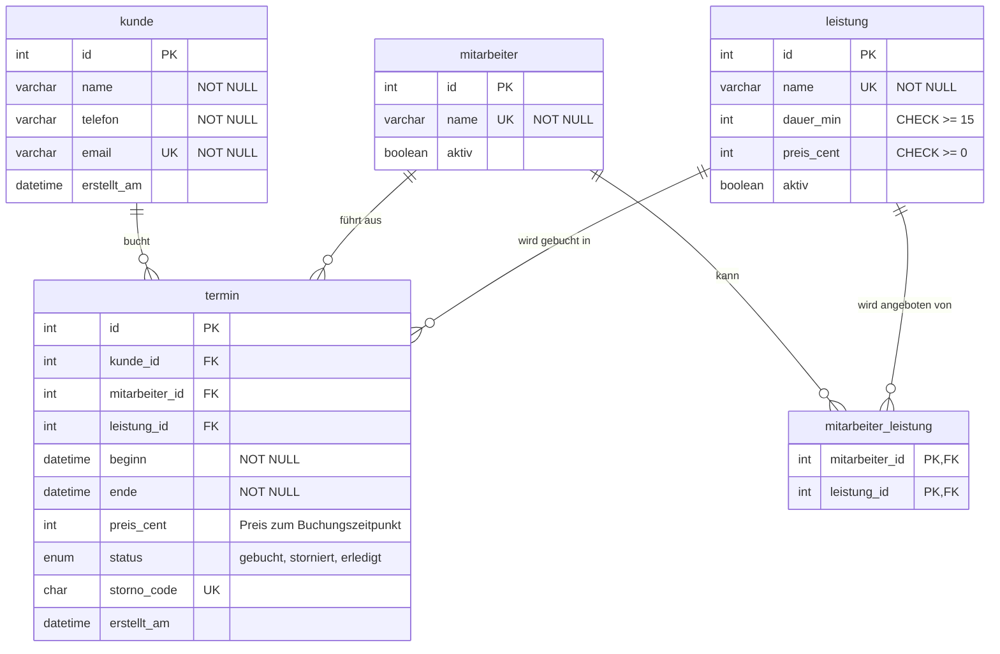

```mermaid
erDiagram
    kunde ||--o{ termin : "bucht"
    mitarbeiter ||--o{ termin : "führt aus"
    leistung ||--o{ termin : "wird gebucht in"
    mitarbeiter ||--o{ mitarbeiter_leistung : "kann"
    leistung ||--o{ mitarbeiter_leistung : "wird angeboten von"

    kunde {
        int id PK
        varchar name "NOT NULL"
        varchar telefon "NOT NULL"
        varchar email UK "NOT NULL"
        datetime erstellt_am
    }
    mitarbeiter {
        int id PK
        varchar name UK "NOT NULL"
        boolean aktiv
    }
    leistung {
        int id PK
        varchar name UK "NOT NULL"
        int dauer_min "CHECK >= 15"
        int preis_cent "CHECK >= 0"
        boolean aktiv
    }
    mitarbeiter_leistung {
        int mitarbeiter_id PK, FK
        int leistung_id PK, FK
    }
    termin {
        int id PK
        int kunde_id FK
        int mitarbeiter_id FK
        int leistung_id FK
        datetime beginn "NOT NULL"
        datetime ende "NOT NULL"
        int preis_cent "Preis zum Buchungszeitpunkt"
        enum status "gebucht, storniert, erledigt"
        char storno_code UK
        datetime erstellt_am
    }
```